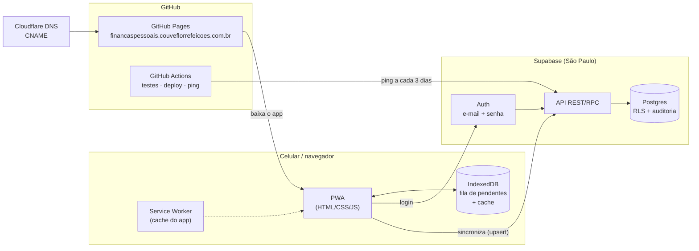
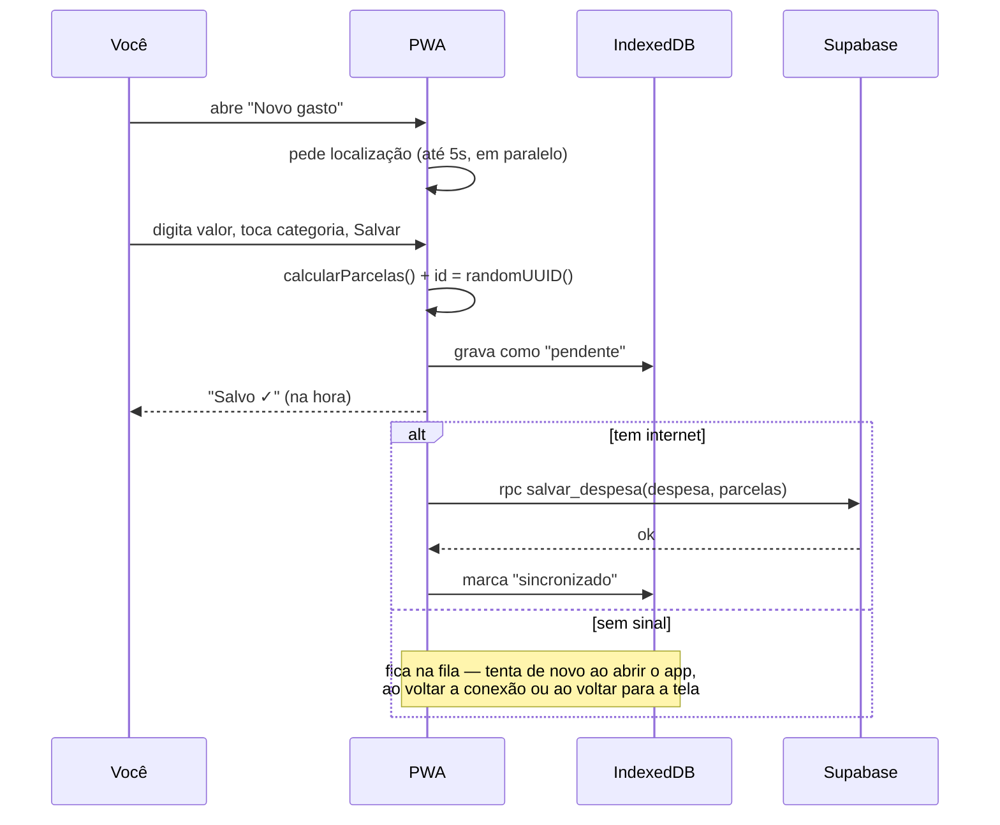
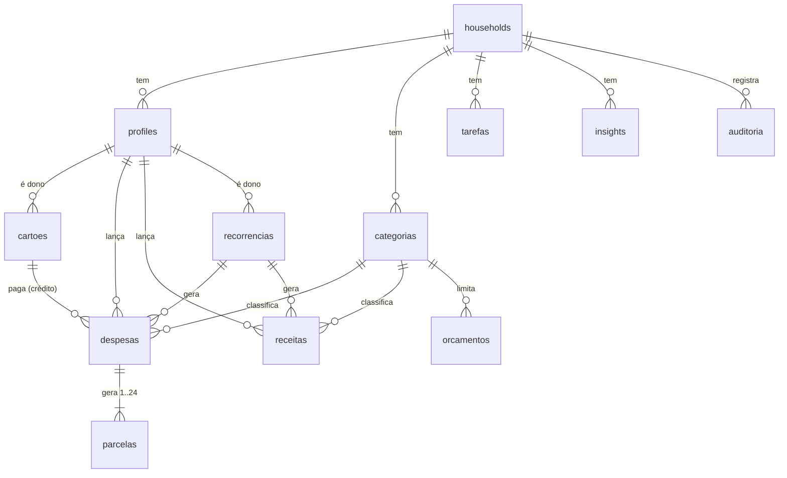

# Arquitetura

## Visão geral



## Fluxo de um gasto



## Banco de dados



| Tabela | Dono | Quem vê | Quem altera |
|---|---|---|---|
| households, profiles | — | a família | só o próprio perfil (nome/cor) |
| categorias, orcamentos, tarefas, insights | família | a família | qualquer membro |
| cartoes, recorrencias | pessoa | a família | só o dono |
| despesas, parcelas, receitas | pessoa | a família | só o dono |
| auditoria | — | a família | ninguém (só o banco escreve) |

### Views do dashboard

| View | Para quê |
|---|---|
| `vw_parcelas_detalhe` | Parcelas vivas + dados da despesa e categoria (base de tudo) |
| `vw_resumo_mensal` | Conciliação: ganhos, gastos (fixos/variáveis/cartão), saldo, % poupança, % fixos. `user_id` nulo = família |
| `vw_gastos_categoria_mes` | Gráfico de pizza / orçamento × realizado |
| `vw_comprometimento_futuro` | Projeção das faturas dos próximos meses |

### Funções chamadas pelo app (RPC)

| Função | Faz |
|---|---|
| `salvar_despesa(despesa, parcelas)` | Cria/edita/exclui despesa e regenera parcelas, atômico e idempotente |
| `excluir_categoria(categoria, destino)` | Move lançamentos para o destino e exclui |
| `excluir_cartao(cartao)` | Apaga (sem uso) ou arquiva (com histórico) |
| `ping()` | Mantém o Supabase gratuito ativo |

## Estrutura de pastas (alvo ao final das fases)

```
/                       ← publicado no GitHub Pages
├─ index.html           app (Fase 2)
├─ manifest.json        PWA (Fase 2)
├─ sw.js                Service Worker (Fase 2)
├─ CNAME                subdomínio (Fase 2)
├─ css/
├─ js/
│  ├─ config.js         gerado no deploy (NÃO vai para o Git)
│  ├─ app.js            inicialização e navegação
│  ├─ db.js             Supabase (único ponto de contato)
│  ├─ offline.js        IndexedDB: fila + cache
│  ├─ sync.js           envio da fila
│  ├─ parcelas.js       calcularParcelas()
│  ├─ estado.js · geo.js · log.js · formato.js · validacao.js
│  ├─ regras.js         motor de regras (Fase 5)
│  ├─ dashboard.js · mapa.js  (Fase 4)
│  └─ ui/               telas
├─ sql/                 scripts do banco (rodar no Supabase, em ordem)
├─ tests/               testes (SQL e JS)
├─ docs/                documentação
├─ claude-skill/        Skill "Consultor Financeiro Familiar" (Fase 5)
└─ .github/workflows/   automações
```
